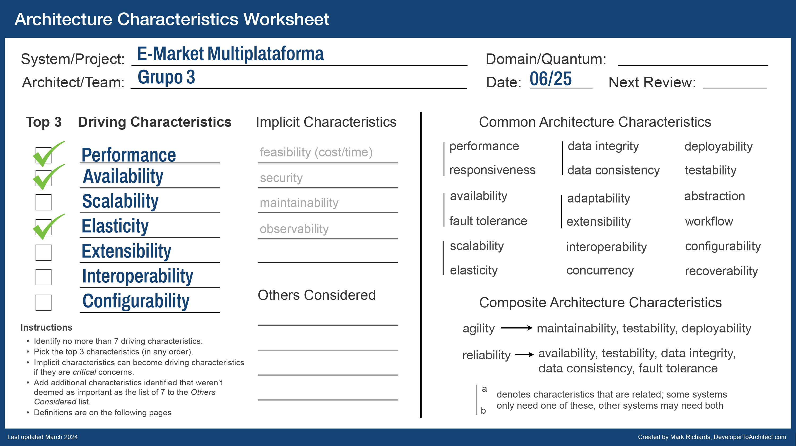
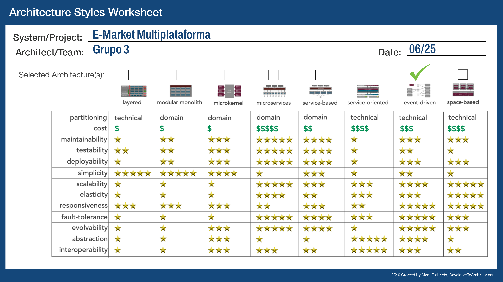
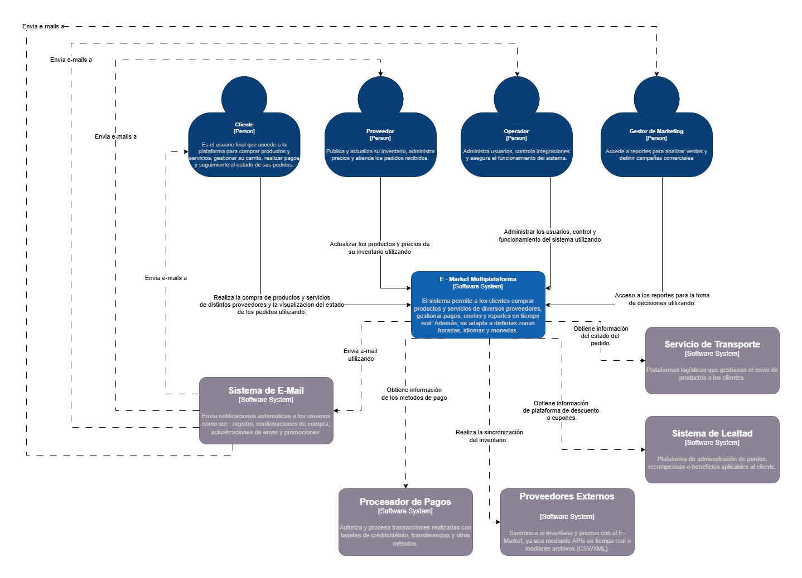
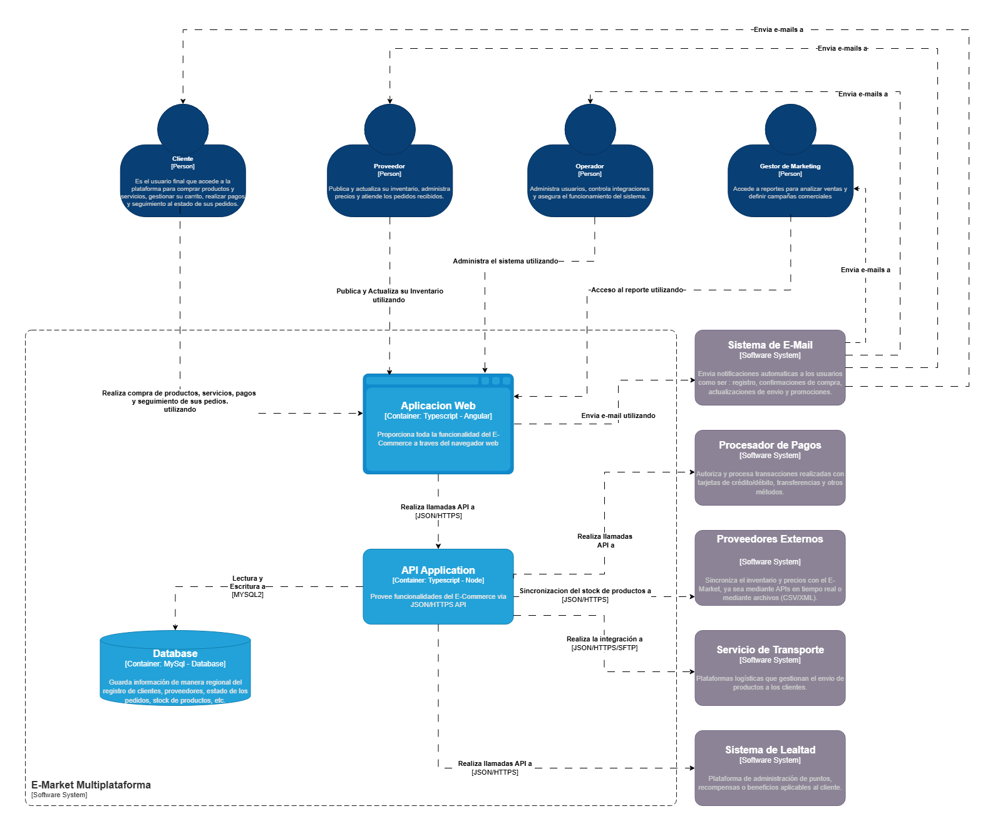
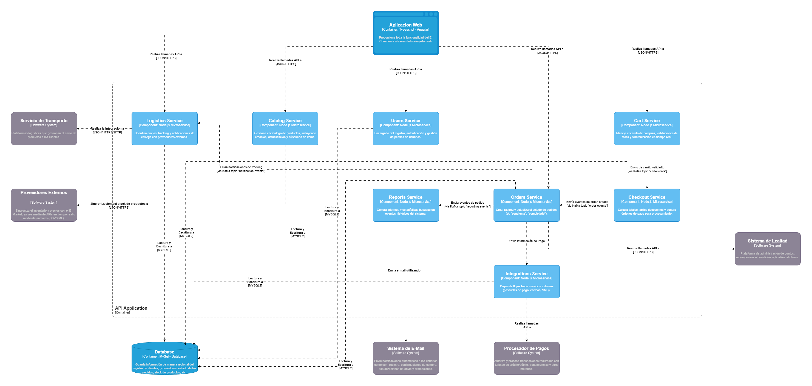
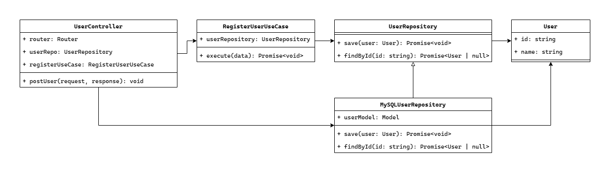
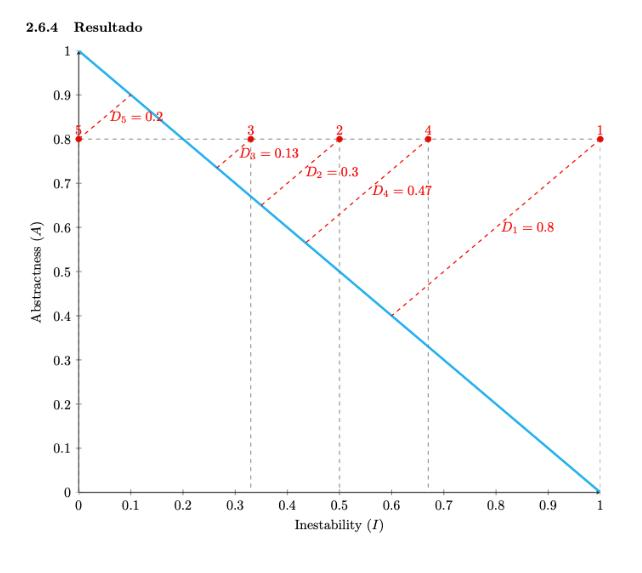

# Proyecto final de la asignatura
## Priorización de características de arquitectura

## Estilo arquitectónico

## Diagrama C4
### Contexto del sistema

### Contenedores

### Componentes

## Diagrama de clase

## Organización de código
La organización del código se encuentra en el archivo [README.md](README.md)

## Distancia de secuencia principal

